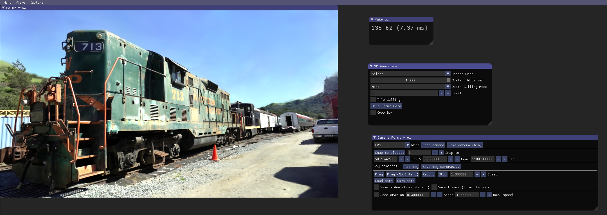
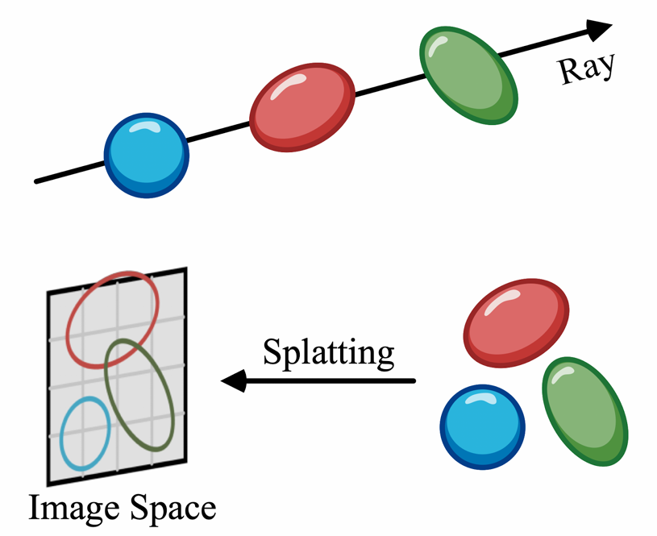
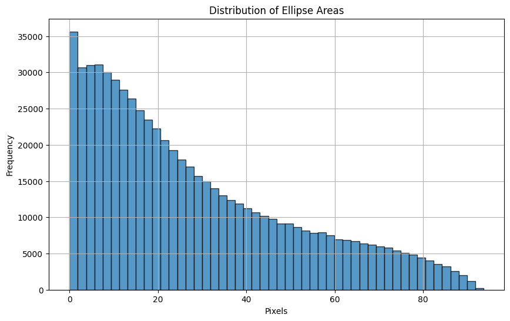
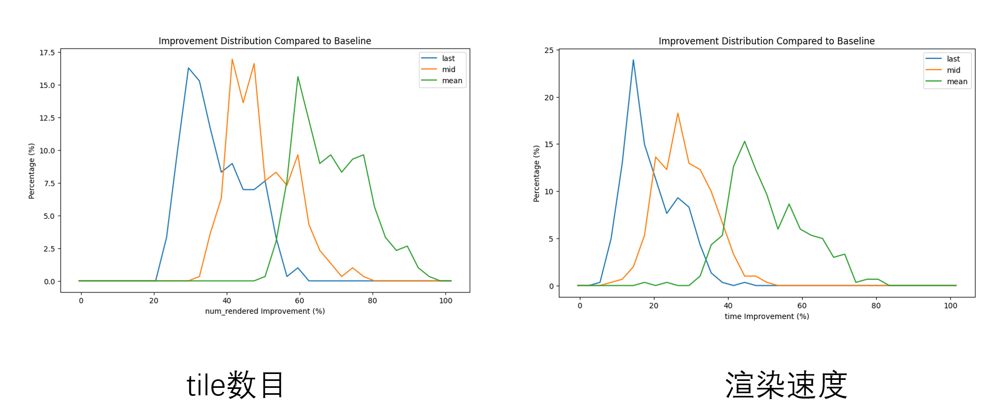
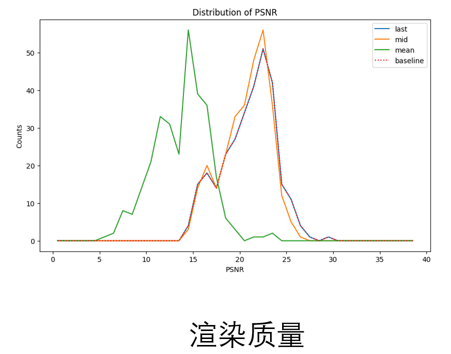
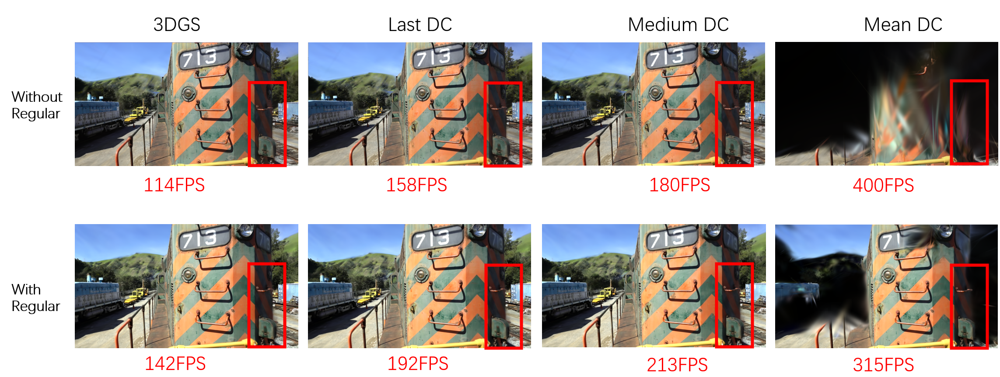

# INSTRUCTION

## 1. How to Use

### 1.1 Enviroment

- RTX4060

- WINDOWS 11, Visual Studio 2019, CUDA 12.2，7zip

### 1.2 Projects

- [**SIBR_views**](https://git.woa.com/LQTech/rainzorwang/SIBR_viewers.git)：3DGS渲染器
  - master：原始3DGS渲染器
  - **HZB：本项目完成的基于深度剔除的3DGS渲染器**
- [**diff-gaussian-rasteration**](https://git.woa.com/LQTech/rainzorwang/diff-gaussian-rasterization.git)：CUDA内核，用于渲染器调用，得到渲染结果
  - main：训练3DGS模型的CUDA内核
  - debug：Debug调试CUDA内核
  - fast_culling：原始3DGS渲染器调用的CUDA内核
  - **HZB：本项目完成的基于深度剔除的CUDA内核**
- [gaussian-splatting](https://git.woa.com/LQTech/rainzorwang/gaussian-splatting)：3DGS原论文 **[[Paper]](https://repo-sam.inria.fr/fungraph/3d-gaussian-splatting/)**
- [RaDe-GS](https://git.woa.com/LQTech/rainzorwang/RaDe-GS) ：利用深度正则化损失函数优化3DGS训练模型  **[[Paper]](https://baowenz.github.io/radegs/)**

### 1.3 Command Lines

```
cd SIBR_views
cmake -Bbuild .
cmake --build build --target install --config Release -j
.\install\bin\SIBR_gaussianViewer_app.exe --vsync 0 -m YOUR_MODELS
```

### 1.4 File dependencies

**SIBR-Views** 在 cmake 阶段自动拷贝 **diff-gaussian-rasteration** 文件内容并进行编译

在 **YOUR_MODELS** 文件中，需要保证是 [**3DGS**](https://git.woa.com/LQTech/rainzorwang/gaussian-splatting) 项目的标准输出格式

在命令行中设置了非垂直同步，便于看到帧率变化

> 注：更多配置细节参考原始 3DGS 项目文件说明 https://github.com/graphdeco-inria/hierarchical-3d-gaussians
>
> 本项目主要改动了 `SIBR_views/src/project/gaussianviewer/renderer`，以及 `diff-gaussian-rasteration` 目录下的文件

### 1.5 Renderer



与原始3DGS内置渲染器相比，添加了：

- `Depth Culling Mode` 选择栏，用于不同的 Culling 模式，包括:
  - `None`：没有Culling
  - `Max`: 前一帧进行颜色累加时，最后一个参与渲染的高斯球位置作为深度参考值
  - `Median:` 前一帧进行颜色累加时，透明度达到0.5时，高斯球位置作为深度参考值
  - `Mean:` 对参与渲染的高斯球深度进行类似颜色渲染的 **$\alpha$- Blending** 操作，取结果作为深度参考值
- `Level`：设置 HZB mipmap 最高级数
- `Tile Culling`：无 HZB，直接存储Tile为像素单位的Depth值作为参考

## 2. Method

### 2.1 Background

3DGS 数据由中心位置 $\mu$，协方差矩阵 $\Sigma$，透明度 $o$，颜色 $c$ 描述场景中的光辐射场，在给定相机位置和视角 $V$ 下，通过 $\alpha$ - Blending 过程，渲染透明材质物体结果：

$$
C(p) = \sum_{i=1}^N c^{\prime}_i\alpha_i\prod_{j=1}^{i-1}(1-\alpha_j)
$$

其中， $c_i’$ 是当前视角 $V$ 下的光照颜色， $\alpha_i = o_i \cdot \exp\{-\frac12(p-\mu_i’)\Sigma_i^{’-1}(p-\mu_i')\}$ 是透明度渲染权重， $\mu_i'$ ， $\Sigma_i'$ 是投影坐标空间下高斯球中心位置和协方差矩阵。

<p align="center">
  
</p>

在 3DGS 渲染CUDA代码实现过程中，主要分成了三个阶段：

- `preprocess`：
  - 预先剔除当前视锥之外的高斯球，剩下的高斯球将参与后续全部过程
  - 计算视锥之内的高斯球投影坐标空间中的位置 $\mu'$，协方差矩阵 $\Sigma'$ 和当前视角下的颜色 $c'$
  - 对高斯球占据`tile`的数目进行分配
- `sort`：根据 `tile_id` 和 相机空间下高斯球深度 `z` 进行排序
- `rendering`：以 `tile` 为单位分块，利用 GPU shared memory 机制，减少数据传输造成的性能损耗，提高渲染速度

### 2.2 Motivation

由于 3DGS 渲染时，采用 $\alpha$-Blending过程，在透明度 $T=\prod_j(1-\alpha_j)$ 达到 0.99 时终止渲染，并输出颜色结果。

本项目基于以下观察：**对于较大范围场景中，物体之间相互遮挡现象很多，这会造成在在 `rendering` 阶段，实际对图像有贡献的 3DGS 占比很少，即在 $T=0.99$时，之后的高斯球没有参与渲染。**

所以，在 `preprocess`、`sort` 阶段存在大量对渲染没有贡献的高斯参与了无用的计算，因此需要对它们进行剔除。

### 2.3 Algorithm

#### Temporal Depth Reuse

为了解决上述提到的问题，关键在于在 `preprocess` 阶段提前剔除那些最终对渲染没有贡献的高斯球。

因此该项目核心思想是：**利用实时渲染连续帧之间的时间相关性特点，即前后两帧之间，大量重复无用的高斯球是相同的，可以进行剔除。**

具体来说，假设前一帧为 $f_0$，下一帧是 $f_1$

1. 在 $f_0$ 的 `rendering` 阶段结束时，在每个像素存储最后一个对渲染渲染有贡献的高斯球相机视角深度 `z_valUe`，最后输出 `depth_buffer`，并保留 $f_0$ 相机的位置和视角。

2. 在 $f_1$ 的 `preprocess` 阶段开始时，除了进行视锥剔除，也根据上一帧 `depth_buffer` 中的数据，剔除哪些对上一帧没有渲染颜色贡献的高斯球。由于高斯球在投影空间中可能占据多个像素，所以需要找到其包含的所有像素位置，并比较 `depth_buffer` 中深度最大值和高斯球深度 `z`，如果 `z` 小于所有占据像素的 `depth_buffer` 值，则保留该高斯球，否则，进行剔除。

   ```c++
   bool is_behind = true;
   for(int y = mipmap_rect_min.y;is_behind && y < mipmap_rect_max.y; y++){
   	for(int x = mipmap_rect_min.x;is_behind && x < mipmap_rect_max.x; x++){
   		float pre_depth = depth_mipmap[y * mipmap_grid.x + x]+0.00001f;
   		is_behind = pre_map_d > pre_depth;
   	}
   }
   if(is_behind) return;
   ```

   

3. 接下来进行颜色 $c'$ 计算，排序，渲染等操作。

> 注：这里的depth buffer 与传统意义上的depth buffer不同，传统的depth buffer常用在前处理阶段，然而由于3DGS采用的是类似于透明度渲染的方式，导致depth buffer计算很困难，因此需要借助上一帧的depth buffer值来进行前处理。

本项目的思路实际上借鉴了实时渲染中 **reverse reprojection** 的思路。

#### Hierarchical Depth Buffer

在利用上一帧的 `depth_buffer` 时，采用的方法是根据高斯球占据所有像素位置处 `depth_buffer` 值与高斯球深度 `z` 进行比较，但是在实验中发现，大多数高斯球在屏幕空间占据的像素数目呈以下分布形式：

<p align="center">
  
</p>

上面的分布说明，采取逐像素比较的策略是十分耗时的，因此应当在创建 `depth_buffer` 时，为其生成 **Mipmap**，即最后得到  **Hierarchical Depth (Z) Buffer (HZB)** ，当高斯球深度需要与 `depth_buffer`，根据其占据像素个数，选择合适的 Mipmap Level，然后再进行比较选择是否剔除高斯球。

```c++
level = 0;
while(pixel_area > 4.0f){
	level++;
	pixel_area /= 4;
}
depth_mipmap = HZB[level];
```

#### Depth Value Strategy

在实验中，在`Depth Buffer`中有三种深度策略，可以作为深度参考值 `z_value` 计算：

1. 保守策略：选择对渲染最后一个有贡献的高斯球深度 `z_last`

2. 激进策略：选择在渲染透明度达到50%时，即 $T=0.5$ 时高斯球的深度 `z_mid`

3. 启发式策略：选择对渲染有贡献的所有高斯球，并对深度进行混合 `z_mean`

$$
 Z_{mean}(p) = \sum_{i=1}^N z_i\alpha_i\prod_{j=1}^{i-1}(1-\alpha_j)
$$

#### Depth Regularization

考虑到本项目中充分利用了高斯球的深度信息，如果在训练阶段考虑深度正则优化，对渲染有贡献的高斯球尽可能地分布在物体表面附近，这将提高深度剔除的效率，因此本项目参考 [RaDe-GS](https://git.woa.com/LQTech/rainzorwang/RaDe-GS) 的做法，采取了以下深度正则化方式：

$$
\mathcal{L}_d=\sum_{all\;pixels}{\sum_{i=1}^N\sum_{j=1}^{i-1}\alpha_i\alpha_j(z_i-z_j)^2}
$$

其中 $\alpha$ 是高斯球的权重和颜色累计计算相同，$z$  是每个高斯球在相机空间中的深度值。

## 3. Experiment

### 3.1 Speed and Quality

首先，我们采用的Mipmap最大值为8，并与传统的3DGS模型训练结果进行对比，同时测试了不同视角的渲染结果，统计高斯球占据的tile数目以及渲染流程的时间的百分比。



图中横坐标是对比原始3DGS渲染过程，我们的方法提升率，纵坐标是提升率的分布占比，图中还对比了不同的 `depth_value` 计算策略下情况。很自然的，我们的方法减少了最终参与排序和渲染的高斯球占据tile的数目，以及提高了整体的渲染时间。

接着，对比了不同的 `depth_value` 计算策略下，对图片质量的影响，采用了 **PSNR** 作为参考值。

<p align="center">
  
</p>

可以看到，我们的保守策略和激进式策略相比于传统的3DGS渲染质量几乎没有影响，但是启发式策略会导致图像质量有较大偏差。

### 3.2 Depth Regularization

接着我们测试了深度正则化对渲染速度的影响：



可以看到采用深度正则化，能够明显提升渲染速度，同时也能够充分加速我们的深度剔除方法。

另外可以看到，当采取深度正则化对场景进行训练时，我们的启发式策略能够渲染一定对近处的物体，也间接说明了我们的深度正则化帮助了高斯球分布在物体表面附近。

## 4. Conclusion and Future Work

### 4.1 Conclusion 

本项目主要基于实时渲染连续帧时间相干的思想，重用前一帧的高斯球深度信息，并在下一帧预处理阶段，对最终渲染没有贡献的高斯球进行剔除。

同时在实验中，对比了三类不同的深度参考值计算策略以及深度正则化对渲染影响，我们的结果表面，利用深度信息在预处理阶段对高斯球进行剔除，加速了3DGS渲染的速度。

在保守深度计算策略下，质量没有影响；在激进策略下，速度得到大大提高，且质量有略微影响；在深度正则化的帮助下，我们的方法能够更好的加速渲染流程。

### 4.2 Future Work

1. 在实验中我们注意到深度正则化对于我们的方法有很大的帮助，且对于启发式策略的质量改善也有贡献，因此未来的工作中定义更好的深度正则化函数，让高斯球在物体表面聚集，且渲染最终也终止在物体表面附近，将能极大的发挥我们工作的加速效果

2. 在3DGS渲染的流程中，有20%的时间开销被用来进行高斯球的排序过程，以辅助后续渲染流程，确定 $\alpha$ **- blending** 的渲染顺序。但是，在前后两帧之间，参与渲染的高斯球顺序大体上是没有变化的，所以，如果能够重用前一帧的排序结果，以加速当前帧的排序流程，将能更好的加速整体渲染流程。

   一种可行的思路是：构建一个 `Sort Tree`，这样在连续帧之间，只需要对 `Sort Tree` 中的节点进行小范围增、删、改，就可以避免每次渲染时重头排序的流程，也可以加速3DGS渲染。

